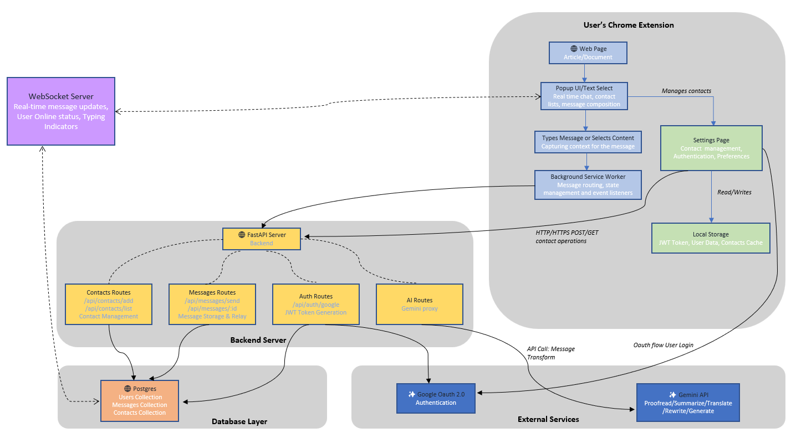

# SeerSync Chrome Extension
## About 
SeerSync is a Chrome extension that enables real-time, privacy-first collaboration directly within the browsing experience. On-device AI processes page content locally using Chrome's built-in AI APIs, ensuring only refined insights: not raw data is shared. A peer-to-peer architecture delivers fast, consistent communication without cloud dependency. SeerSync preserves semantic context across web navigation, allowing teams to collaboratively capture, annotate, and synthesize information without leaving the browser. By integrating Google Gemini APIs for local processing, SeerSync combines cutting-edge AI with seamless UX to redefine web collaboration.

### What's achieved until 31.10.2025
- ✅ Chrome Extension with React + TypeScript + Tailwind
- ✅ FastAPI Backend with health endpoints
- ✅ Google OAuth Authentication - Users can sign in
- ✅ User Registration - Users sync to backend
- ✅ Extension ↔ Backend Communication working

#### [Visit Website](https://seer-sync-git-main-rajpreet2206s-projects.vercel.app/)
### 

### What're the next steps:
- We built a production-ready Chrome extension communication platform using modern web technologies. The frontend is a Manifest V3 Chrome extension built with React 18, TypeScript, and Tailwind CSS, featuring Google OAuth 2.0 authentication via the chrome.identity API. The extension implements a modular architecture with separate service workers for background tasks, content scripts for page-level integration, and a React-based popup UI. User authentication state is persisted in chrome.storage.local, and the extension communicates with the backend via RESTful APIs with proper CORS configuration for chrome-extension:// origins.
- The backend is a FastAPI application with PostgreSQL database managed through SQLAlchemy ORM and Docker containerization. We implemented a complete user management system with OAuth token verification, automatic user registration on first login, and a relational contact management system with foreign key constraints and cascade deletes. The database schema includes indexed fields for query optimization (google_id, email) and proper timestamp tracking (created_at, updated_at). The API follows RESTful conventions with dependency injection for database sessions, Pydantic schemas for request/response validation, and proper error handling with HTTP status codes.

#### uvicorn app.main:app --reload --host 0.0.0.0 --port 8000
#### npm run build
#### docker exec -it chrome-comm-db psql -U postgres -d chrome_comm
#### INSERT INTO users (id, email, name, google_id, picture) VALUES ('test-user-id-2', 'bestfriend@gmail.com', 'Best Friend', 'google-123', NULL);
#### INSERT INTO users (id, email, name, google_id, picture) VALUES ('test-user-id-4', 'builtInAI@gmail.com', 'Built-In', 'google-124', NULL);
#### INSERT INTO users (id, email, name, google_id, picture) VALUES ('test-user-id-5', 'LetsWinIt@gmail.com', 'Supervisor', 'google-1024', NULL);